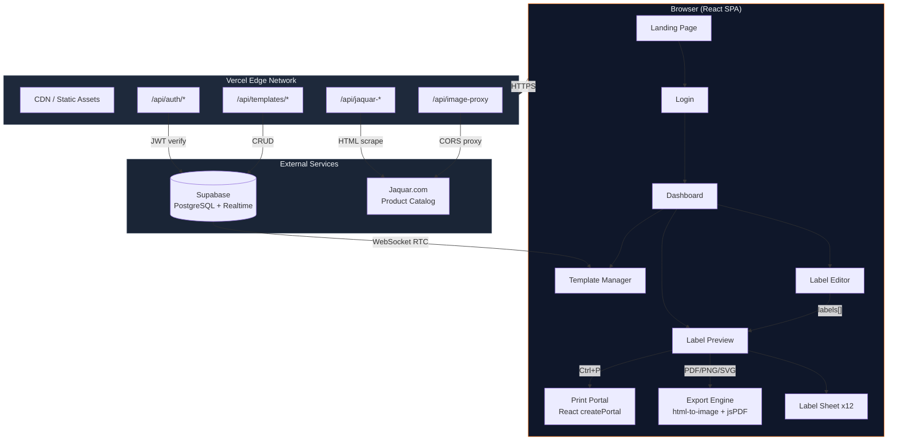
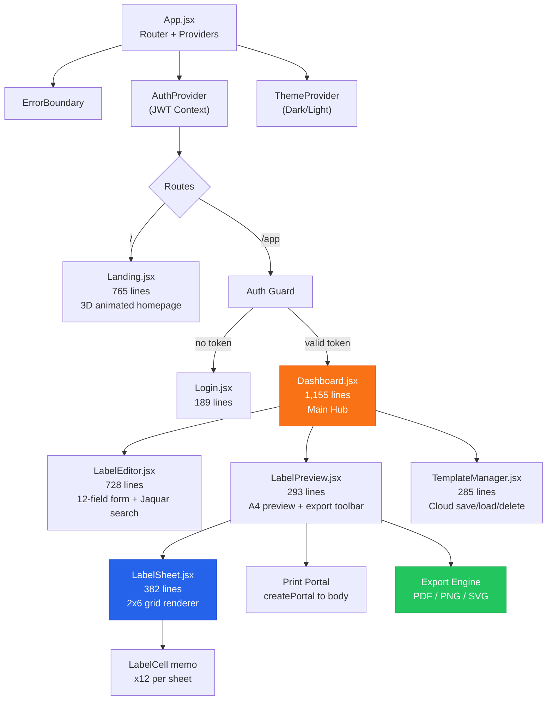
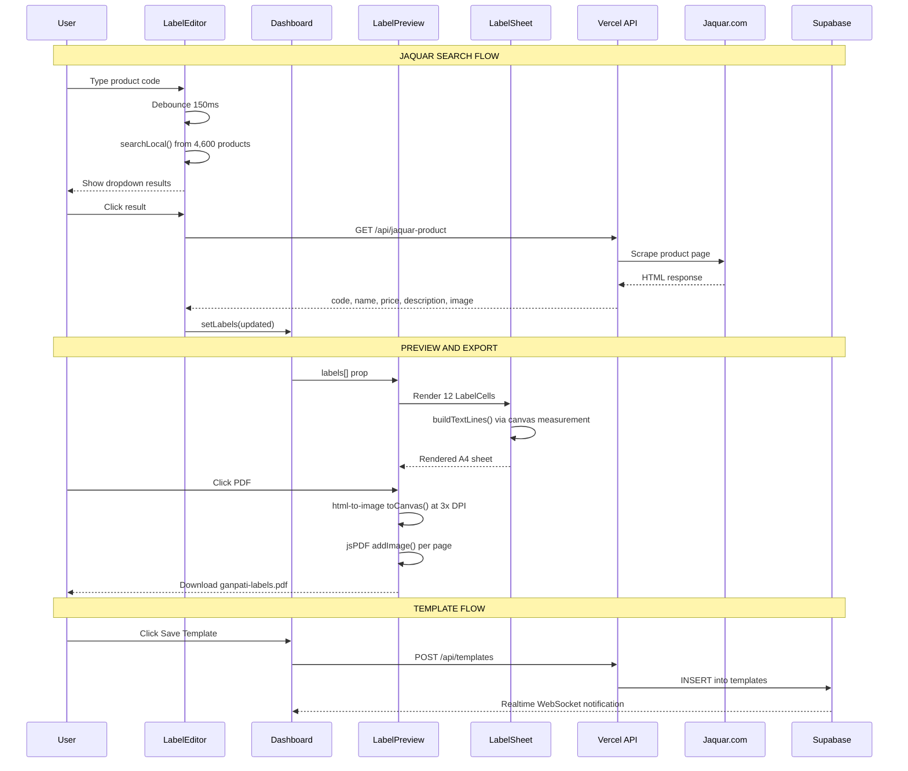
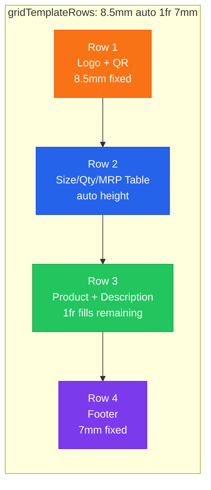
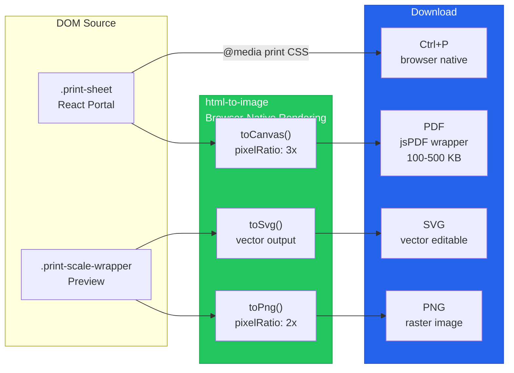
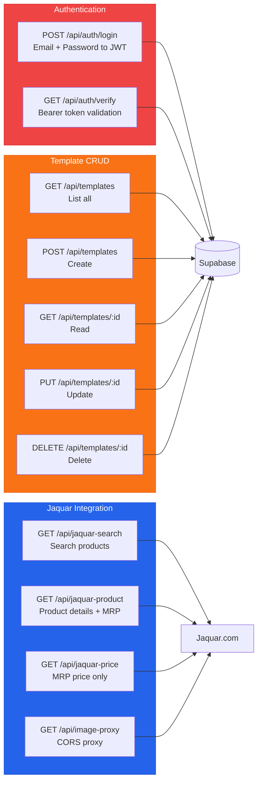
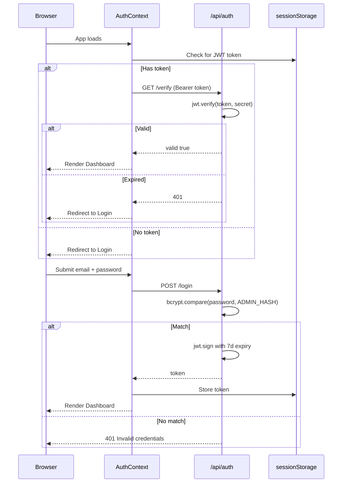
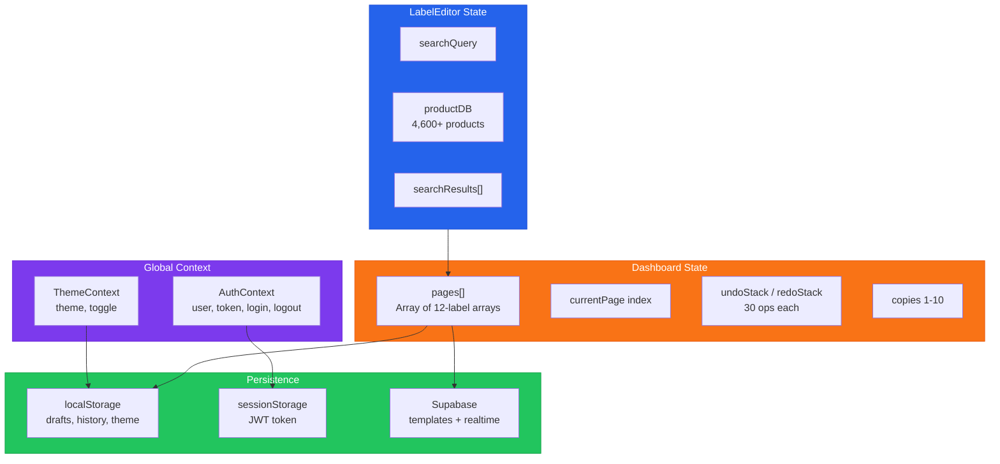
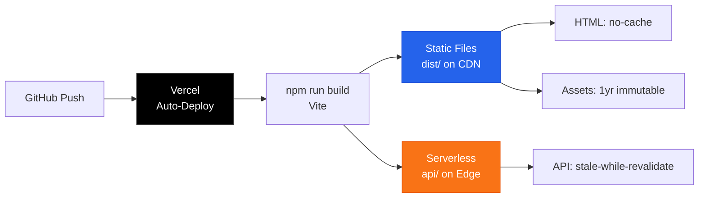

<div align="center">

# Shree Ganpati Agency -- Label Print System v3.2

**Precision A4 label printing with Jaquar product integration, vector PDF export, and cloud sync**

[](https://github.com/NIGHT-FURY-6023/printer-image-generator/releases)
[](https://reactjs.org/)
[](https://vitejs.dev/)
[](https://tailwindcss.com/)
[](https://supabase.com/)
[](https://vercel.com/)
[]()

> Print **12 labels per A4 sheet** (105x48mm each, 2x6 grid) with live preview, **instant Jaquar product search** (4,600+ products), **browser-native PDF/PNG/SVG export**, cloud templates, CSV import, and multi-page support. Built for Indian market hardware distribution workflows.

</div>

---

## Table of Contents

- [System Architecture](#system-architecture)
- [Tech Stack](#tech-stack)
- [Component Architecture](#component-architecture)
- [Data Flow](#data-flow)
- [Label Anatomy](#label-anatomy)
- [Export Pipeline](#export-pipeline)
- [API Routes](#api-routes)
- [Authentication Flow](#authentication-flow)
- [Project Structure](#project-structure)
- [Features](#features)
- [Whats New in v3.2](#whats-new-in-v32)
- [Getting Started](#getting-started)
- [Environment Variables](#environment-variables)
- [Keyboard Shortcuts](#keyboard-shortcuts)
- [Performance](#performance)

---

## System Architecture



---

## Tech Stack

| Layer | Technology | Purpose |
|:------|:-----------|:--------|
| **Frontend** | React 18.2 + Hooks | Component UI with memo optimization |
| **Build** | Vite 6.0 | HMR, code-splitting, tree-shaking |
| **Styling** | Tailwind CSS 4.0 | Utility-first + custom theme variables |
| **Routing** | React Router 7.13 | Client-side SPA navigation |
| **Animations** | Framer Motion 12.38 + anime.js 4.3 | 3D tilt cards, counter animations |
| **PDF** | jsPDF 2.5 | Vector PDF generation |
| **DOM Capture** | html-to-image 1.11 | Browser-native PNG/SVG/Canvas export |
| **QR Codes** | qrcode 1.5 | Per-label QR code generation (LRU cached) |
| **Backend** | Vercel Serverless Functions | 9 API endpoints (Node.js) |
| **Database** | Supabase (PostgreSQL) | Template storage + realtime sync |
| **Auth** | JWT + bcrypt | 7-day tokens, salt-12 password hashing |
| **Notifications** | react-hot-toast 2.6 | Toast feedback for all operations |
| **Deployment** | Vercel CDN | Auto-deploy from GitHub, edge caching |

---

## Component Architecture



### Component Sizes

| Component | Lines | Responsibility |
|:----------|------:|:---------------|
| Dashboard.jsx | 1,155 | Page management, undo/redo, CSV import, history, state hub |
| Landing.jsx | 765 | Public homepage with 3D animations and feature showcase |
| LabelEditor.jsx | 728 | 11 form fields per label, Jaquar live search, bulk operations |
| LabelSheet.jsx | 382 | A4 sheet renderer (2x6 CSS Grid), canvas text measurement |
| LabelPreview.jsx | 293 | Scaled A4 preview, PDF/PNG/SVG export, print portal, toolbar |
| TemplateManager.jsx | 285 | Supabase CRUD + localStorage fallback, realtime sync |
| Login.jsx | 189 | JWT auth form with validation |
| ErrorBoundary.jsx | 89 | Error UI fallback |

**Total: ~3,886 lines of component code**

---

## Data Flow



---

## Label Anatomy

Each A4 sheet holds **12 labels** in a **2-column x 6-row** CSS Grid.

### A4 Sheet Layout (210mm x 297mm)

```
+-----------------------------------------------------+
|  7mm padding                                         |
|  +---------------------+  +---------------------+   |
|  |     Label 1         |1m|     Label 2         |   |
|  |   105mm x 48mm      |  |   105mm x 48mm      |   |
|  +---------------------+  +---------------------+   |
|  +---------------------+  +---------------------+   |
|  |     Label 3         |  |     Label 4         |   |
|  +---------------------+  +---------------------+   |
|  +---------------------+  +---------------------+   |
|  |     Label 5         |  |     Label 6         |   |
|  +---------------------+  +---------------------+   |
|  +---------------------+  +---------------------+   |
|  |     Label 7         |  |     Label 8         |   |
|  +---------------------+  +---------------------+   |
|  +---------------------+  +---------------------+   |
|  |     Label 9         |  |     Label 10        |   |
|  +---------------------+  +---------------------+   |
|  +---------------------+  +---------------------+   |
|  |     Label 11        |  |     Label 12        |   |
|  +---------------------+  +---------------------+   |
|  3.5mm                                    3.5mm      |
+-----------------------------------------------------+
```

### Single Label Layout (105mm x 48mm)

```
+=====+============================================+
| I   | [BRAND LOGO]              [QR CODE]  8.5mm |
| T   |--------------------------------------------|
| E   | Size  | Qty  | MRP (Per Piece)      auto  |
| M   | 15mm  |  1   | Rs.3,800.00                |
|     |       |      | (Incl. of All Taxes)       |
| C   |--------------------------------------------|
| O   | PRODUCT NAME HERE        | [PRODUCT]  1fr  |
| D   | Description text that    |  [IMAGE]        |
| E   | wraps to multiple lines  |    11mm         |
|     |--------------------------------------------|
| 5.5 | Jaquar & Co. Pvt. Ltd.   Made in India 7mm |
| mm  | Mfg: 03/2026    service@jaquar.com          |
|     |                          1800-102-9900      |
+=====+============================================+
```

### Label CSS Grid Rows



### Label Data Fields (11 per label)

| # | Field | Type | Source | Display Location |
|:-:|:------|:-----|:-------|:-----------------|
| 1 | code | String | Jaquar / Manual | Left vertical strip |
| 2 | manufacturer | String | Jaquar / Manual | Logo fallback text |
| 3 | logoUrl | URL | Auto / Manual | Top-left logo |
| 4 | product | String | Jaquar / Manual | Product name (bold, 2 lines max) |
| 5 | description | String | Jaquar / Manual | Below product (3 lines max) |
| 6 | price | String | Jaquar / Manual | MRP cell with rupee symbol |
| 7 | size | String | Manual | Table cell |
| 8 | qty | String | Manual | Table cell |
| 9 | productUrl | URL | Jaquar | QR code source |
| 10 | productImage | URL | Jaquar | Right side product image |
| 11 | mfgDate | MM/YYYY | Auto-generated | Footer (3-5 months before today) |

---

## Export Pipeline



### Why html-to-image over html2canvas?

| Feature | html2canvas | html-to-image |
|:--------|:----------:|:-------------:|
| CSS Grid support | None | Full |
| Rendering engine | JS reimplementation | Browser-native (SVG foreignObject) |
| Layout accuracy | Approximate | Pixel-perfect |
| Bundle size | 202 KB | 14 KB |
| Flexbox support | Partial | Full |

---

## API Routes



| Endpoint | Method | Auth | Response |
|:---------|:-------|:----:|:---------|
| /api/auth/login | POST | No | token + expiresIn |
| /api/auth/verify | GET | Bearer | valid: true/false |
| /api/templates | GET | Bearer | Array of templates |
| /api/templates | POST | Bearer | Created template |
| /api/templates/:id | GET/PUT/DELETE | Bearer | Template object |
| /api/jaquar-search | GET | No | Array of products |
| /api/jaquar-product | GET | No | Product details + MRP |
| /api/jaquar-price | GET | No | MRP price |
| /api/image-proxy | GET | No | Binary image (jaquar.com only) |

---

## Authentication Flow



### Security

| Measure | Implementation |
|:--------|:---------------|
| Password hashing | bcrypt, 12 salt rounds |
| Token expiry | 7 days |
| Token storage | sessionStorage (cleared on browser close) |
| API auth | Bearer token on /api/templates/* |
| CORS | Restricted to FRONTEND_URL env var |
| CSP | Strict Content-Security-Policy in vercel.json |
| Image proxy | Whitelists jaquar.com domain only |
| Input sanitization | Logo URLs validated (http/https/relative only) |

---

## Project Structure

```
printer-image-generator/
|
|-- src/
|   |-- main.jsx                        Entry point + Service Worker registration
|   |-- App.jsx                         Router + Auth/Theme providers
|   |-- index.css                       Tailwind + print CSS + theme vars + animations
|   |
|   |-- components/
|   |   |-- Landing.jsx                 Public homepage (3D cards, animations)
|   |   |-- Login.jsx                   JWT auth form
|   |   |-- Dashboard.jsx              Main editor hub (state management center)
|   |   |-- LabelEditor.jsx            12-field form + Jaquar live search
|   |   |-- LabelPreview.jsx           A4 preview + PDF/PNG/SVG/Print export
|   |   |-- LabelSheet.jsx             Single A4 sheet (2x6 grid + text measurement)
|   |   |-- TemplateManager.jsx        Cloud save/load/delete templates
|   |   |-- ErrorBoundary.jsx          Error UI fallback
|   |
|   |-- contexts/
|   |   |-- AuthContext.jsx             JWT auth state + login/logout
|   |   |-- ThemeContext.jsx            Dark/Light theme toggle
|   |
|   |-- services/
|   |   |-- api.js                      Axios instance + JWT interceptor + API helpers
|   |   |-- supabase.js                 Supabase client singleton
|   |
|   |-- utils/
|       |-- mfgDate.js                  Random MFG date (3-5 months back, MM/YYYY)
|       |-- dynamicImport.js            Stale chunk recovery with cache-bust reload
|
|-- api/
|   |-- auth/
|   |   |-- login.js                    POST: email+password -> JWT token
|   |   |-- verify.js                   GET: Bearer token validation
|   |-- templates/
|   |   |-- index.js                    GET/POST: list + create templates
|   |   |-- [id].js                     GET/PUT/DELETE: single template
|   |-- jaquar-search.js               GET: search jaquar.com (HTML scrape)
|   |-- jaquar-product.js              GET: product details + MRP
|   |-- jaquar-price.js                GET: MRP price extraction
|   |-- image-proxy.js                 GET: CORS proxy for jaquar.com images
|   |-- _lib/
|       |-- db.js                       Supabase client wrapper + DB helpers
|
|-- public/
|   |-- jaquar-products.json            4,600+ products preloaded (1.2 MB)
|   |-- jaquar-logo.png                 Brand logo
|   |-- manifest.json                   PWA manifest
|   |-- sw.js                           Service Worker (basic offline)
|   |-- favicon.svg / og-image.png      Icons and social preview
|
|-- scripts/
|   |-- build-jaquar-db.js             Crawl jaquar.com -> products JSON
|   |-- generate-hash.js               Generate bcrypt password hash
|   |-- generate-label-pdf.js          Standalone PDF generator (testing)
|   |-- generate-og.js                 Generate OG image
|   |-- setup-db.sql                   Supabase schema setup
|
|-- vercel.json                         Headers, rewrites, cache rules
|-- vite.config.js                      Vite + React + Tailwind plugins
|-- package.json                        Dependencies + scripts
```

---

## Features

### Core Workflow

1. **Login** -- Single admin JWT auth with bcrypt password verification
2. **Search** -- Type product code, get instant results from 4,600+ Jaquar products
3. **Fill** -- Auto-populate all 11 fields per label from Jaquar catalog
4. **Preview** -- Live A4 preview with exact 210x297mm dimensions
5. **Export** -- PDF, PNG, SVG download or Ctrl+P browser print

### Label Editor

- 12 labels per page (2x6 grid on A4)
- 11 editable fields per label
- Live Jaquar search with dropdown (150ms debounce, <5ms local search)
- Auto-fill: code, name, description, price, product URL, product image
- QR code auto-generated from product URL
- Bulk operations: fill all, duplicate, copy/paste between labels

### Multi-page Support

- Unlimited A4 pages (12 labels each)
- Page navigator with filled-count badges
- Add, remove, duplicate pages
- All pages exported in single PDF

### Data Management

- **CSV Import** -- Upload or paste CSV data with auto-preview
- **CSV Export** -- All 11 fields with headers
- **JSON Import/Export** -- Full backup and restore
- **Cloud Templates** -- Save/load/delete via Supabase with realtime sync
- **Print History** -- Last 30 operations in localStorage with auto-naming
- **Template Gallery** -- Pre-built templates for quick start
- **Undo/Redo** -- 30-operation stack (Ctrl+Z / Ctrl+Y)
- **Auto-save** -- Draft saved every 1.2s + periodic 30s backup

### UI/UX

- Dark theme (default) with light theme toggle
- 3D depth panels with CSS perspective + translateZ
- Glassmorphism cards with backdrop-filter blur
- Animated landing page (Framer Motion + anime.js)
- Responsive layout: 42% editor / 58% preview split
- Mobile fallback at 768px breakpoint
- Active label glow animation with pulsing ring

---

## Whats New in v3.2

### Browser-Native Export Engine

- **Replaced html2canvas with html-to-image** -- uses browser own rendering engine via SVG foreignObject
- Full CSS Grid support in exports (html2canvas had zero grid-template support)
- Pixel-perfect PDF/PNG/SVG output matching the browser preview exactly
- 14x smaller library (14 KB vs 202 KB)

### Print Text Clipping Fix

- Removed overflow hidden from individual label cells
- Moved overflow control to CSS Grid cell level (.sheet > *)
- Text no longer gets cut off during Ctrl+P print

### Stale Chunk Recovery

- Cache-busting page reload on dynamic import failures after redeployment
- no-cache headers extended to all SPA routes (not just /index.html)
- Eliminates "Failed to fetch dynamically imported module" errors

### Previous Highlights (v3.1)

- 4,600+ Jaquar products preloaded for instant local search
- React Portal print system (no blank pages)
- Code splitting: 500KB to 235KB main bundle (53% reduction)
- 3D dynamic UI with depth panels and glow animations
- Multi-page labels with page navigator
- Auto-generated manufacturing dates (3-5 months back)

---

## Getting Started

### Prerequisites

- Node.js 18+
- npm 9+
- Supabase project (for cloud templates)

### Installation

```bash
git clone https://github.com/NIGHT-FURY-6023/printer-image-generator.git
cd printer-image-generator

npm install

# Generate password hash for admin login
node scripts/generate-hash.js "your-admin-password"

# Set up environment variables
cp .env.example .env
# Fill in all values (see Environment Variables below)

# Set up Supabase schema (run in Supabase SQL editor)
# See scripts/setup-db.sql

# Start development server
npm run dev
```

### Build for Production

```bash
npm run build      # Output in dist/
npm run preview    # Test production build locally
```

### Rebuild Jaquar Product Database

```bash
node scripts/build-jaquar-db.js    # Crawls jaquar.com -> public/jaquar-products.json
```

---

## Environment Variables

| Variable | Scope | Purpose |
|:---------|:------|:--------|
| JWT_SECRET | Server | JWT signing secret |
| ADMIN_EMAIL | Server | Admin login email |
| ADMIN_PASSWORD_HASH | Server | bcrypt hash of admin password |
| SUPABASE_URL | Server | Supabase project URL |
| SUPABASE_SERVICE_ROLE_KEY | Server | Supabase server-side key |
| VITE_SUPABASE_URL | Client | Supabase project URL (browser) |
| VITE_SUPABASE_ANON_KEY | Client | Supabase anon key (browser) |
| FRONTEND_URL | Server | CORS allowed origin |

---

## Keyboard Shortcuts

| Shortcut | Action |
|:---------|:-------|
| Ctrl + P | Print all pages |
| Ctrl + Z | Undo last change |
| Ctrl + Y | Redo |
| Escape | Close modals |

---

## Performance

| Metric | Value |
|:-------|------:|
| Main bundle (code-split) | 235 KB |
| Dashboard chunk | 107 KB |
| Landing chunk | 198 KB |
| Login chunk | 6 KB |
| Jaquar local search | < 5ms |
| PDF generation | 1-3 seconds |
| QR code cache | LRU, 50 entries |
| Undo stack depth | 30 operations |
| Auto-save interval | 1.2s draft + 30s periodic |
| Jaquar product DB | 4,600+ products (1.2 MB) |

---

## State Management



---

## Deployment



---

<div align="center">

**Built with precision for Shree Ganpati Agency**

React + Vite + Tailwind + Supabase + Vercel

</div>
