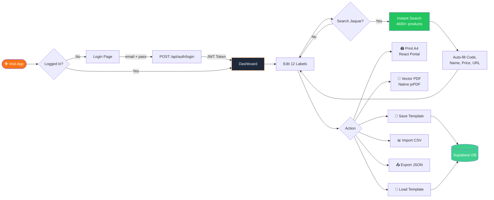
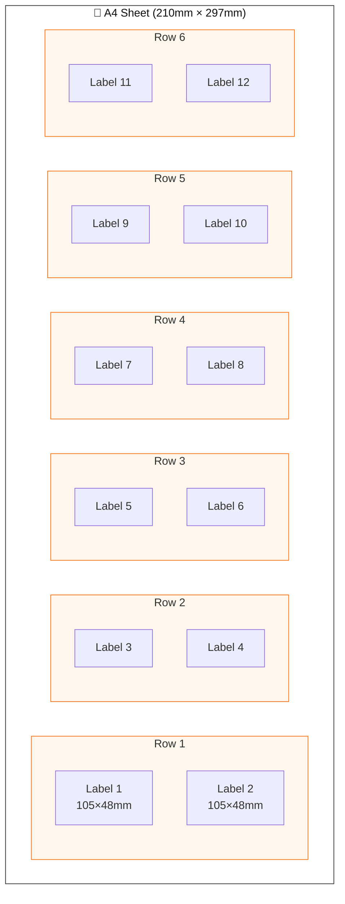
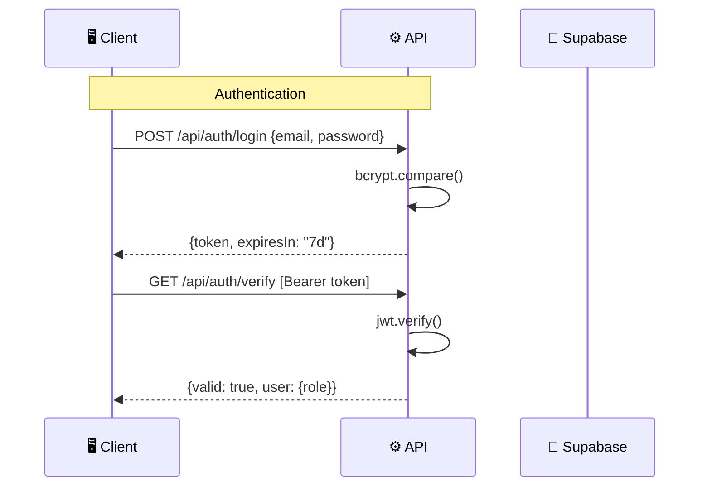
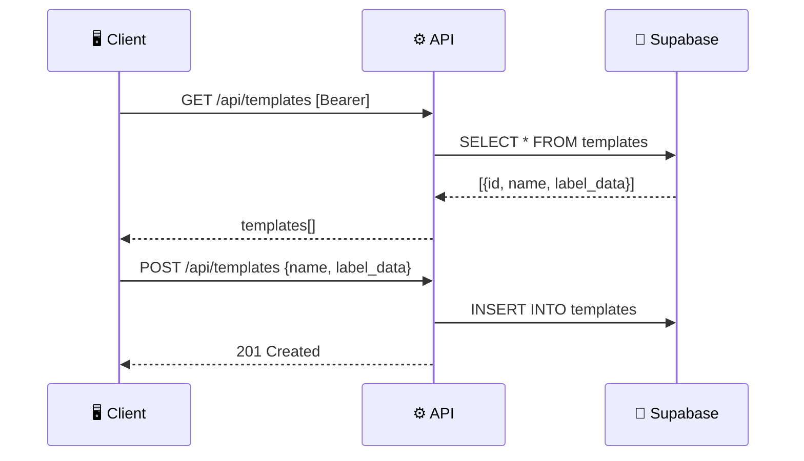
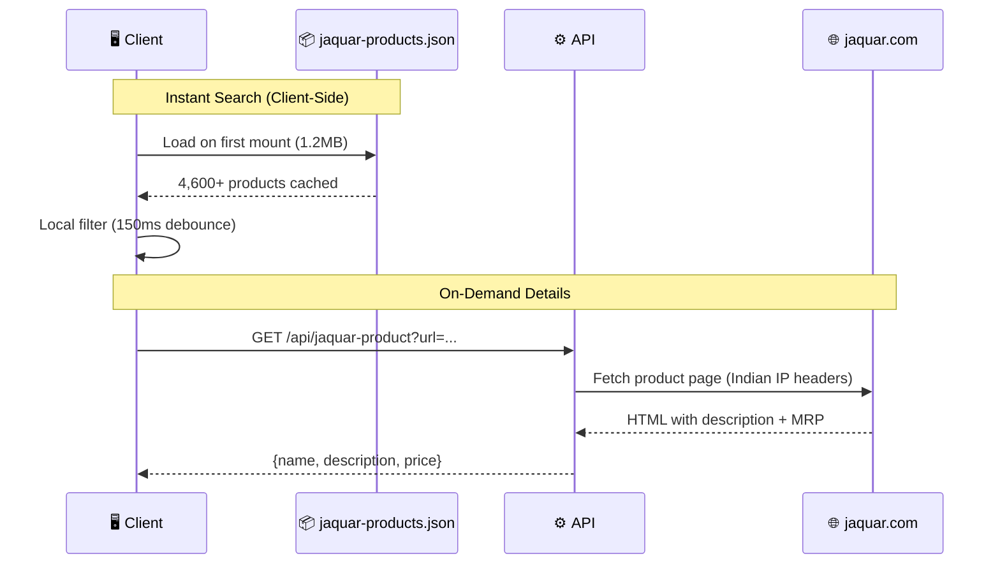
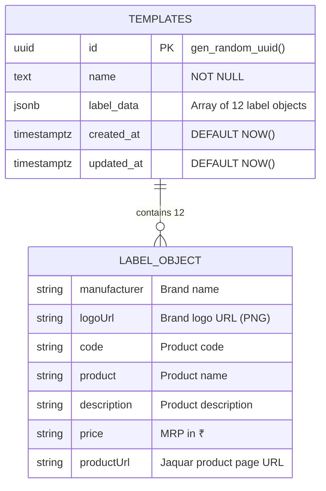

<div align="center">

# 🏷️ Shree Ganpati Agency — Label Print System v3.0

**Precision A4 label printing with Jaquar product integration & vector PDF export**

[](https://github.com/NICK-FURY-6023/printer-image-generator/releases)
[](https://reactjs.org/)
[](https://vitejs.dev/)
[](https://tailwindcss.com/)
[](https://supabase.com/)
[](https://vercel.com/)
[]()

> Print **12 labels per A4 sheet** (105×48mm each, 2×6 grid) with live preview, **instant Jaquar product search** (4,600+ products), **vector PDF export**, cloud templates, and CSV import. Built for Indian market workflows.

</div>

---

## 📸 Screenshots

| Landing Page (3D Particles + Animations) | Dashboard (3D Depth + Glassmorphism) |
|:---:|:---:|
|  |  |

| Selection Indicator + Jaquar Search | Multi-Page PDF Export |
|:---:|:---:|
|  |  |

| Page Navigator (Add/Remove/Duplicate) | Print History (Auto-named) |
|:---:|:---:|
|  |  |

---

## 🆕 What's New in v3.0.0

### 🔍 Jaquar Product Integration
- **4,600+ products** preloaded in a local JSON database — instant client-side search
- Search by **product code** or **product name** with real-time dropdown
- Auto-fills: code, name, description, and **exact MRP price** from jaquar.com
- QR codes auto-generated from Jaquar product URLs

### 📄 Vector PDF Engine (Native jsPDF)
- **Completely rewritten** PDF generator — no more html2canvas screenshots
- Text is **real vector text** — never cuts, always sharp, fully selectable & searchable
- PDF file size: **100–500 KB** (was 30 MB with the old raster approach)
- Transparent brand logos preserved with PNG alpha channel
- Grid, borders, and text drawn directly via jsPDF native drawing API

### 🖨️ Reliable Ctrl+P Printing
- Uses **React Portal** (`createPortal`) to render print content directly under `<body>`
- Eliminates blank-page issues caused by CSS `:not()` selector conflicts
- Clean print CSS — only 15 lines

### ⚡ Performance Improvements
- **Code splitting** via `React.lazy` — Dashboard (81KB), Landing (186KB), Login (6KB) loaded on demand
- **React.memo** on label cells — only re-renders cells that actually changed
- Main bundle reduced from **500KB → 235KB** (53% smaller)
- Jaquar search: 150ms debounce, module-level cache, sorted by prefix match

### 🎨 3D Dynamic UI
- **3D depth panels** — CSS perspective + translateZ for layered depth effect
- **Card hover lift** — Cards lift up with enhanced shadow on hover
- **Active label glow** — Animated pulsing ring on the selected label card
- **"Currently Editing" bar** — Floating indicator showing active label name, code, and status
- **Enhanced dot navigator** — Scale + glow animations on active/filled dots
- **Gradient backgrounds** — Subtle depth gradients on all panels

### 📄 Multi-page Labels
- Add unlimited pages — each page holds 12 labels (one A4 sheet)
- Page navigator bar with filled-count badges per page
- Add, remove, and duplicate pages
- PDF exports all pages × copies
- Ctrl+P prints all pages
- History and templates save/restore all pages

### 🏷️ History Auto-naming
- Auto-generated names from product codes and brands
- Format: `Jaquar ALD-CHR-079N +5 (2pg)`
- Easily identify entries without manual naming

---

## 🏗️ Architecture

```mermaid
graph TB
    subgraph Frontend ["🖥️ Frontend (React + Vite)"]
        LP[Landing Page]
        LG[Login]
        DB[Dashboard]
        LE[Label Editor]
        LS[Label Sheet]
        LV[Label Preview]
        TM[Template Manager]
    end

    subgraph Jaquar ["🔍 Jaquar Integration"]
        JDB[(jaquar-products.json<br/>4,600+ products)]
        JP[/api/jaquar-product]
        JPR[/api/jaquar-price]
    end

    subgraph Auth ["🔐 Auth Layer"]
        JWT[JWT Token]
        BC[Bcrypt Hash]
    end

    subgraph Backend ["⚙️ Vercel Serverless API"]
        AL[POST /api/auth/login]
        AV[GET /api/auth/verify]
        TG[GET /api/templates]
        TP[POST /api/templates]
        TU[PUT /api/templates/:id]
        TD[DELETE /api/templates/:id]
    end

    subgraph Storage ["💾 Supabase"]
        PG[(PostgreSQL)]
    end

    LP --> LG
    LG --> |email + password| AL
    AL --> |JWT| JWT
    JWT --> DB
    DB --> LE & LV
    LE --> |instant search| JDB
    LE --> |fetch details| JP
    LE --> LS
    LV --> LS
    DB --> TM
    TM --> TG & TP & TU & TD
    TG & TP & TU & TD --> PG

    AV --> |verify| JWT

    style Frontend fill:#1e293b,color:#f1f5f9,stroke:#f97316
    style Jaquar fill:#1e293b,color:#f1f5f9,stroke:#22c55e
    style Backend fill:#0f172a,color:#f1f5f9,stroke:#2563eb
    style Storage fill:#0f172a,color:#f1f5f9,stroke:#3FCF8E
    style Auth fill:#1e293b,color:#f1f5f9,stroke:#eab308
```

---

## 🔄 User Flow



---

## 📐 Label Layout



**Each label contains:**
```
┌──────────────────────────────────────────────────────────┐
│ ┌──────┐                                      ┌───────┐ │
│ │BRAND │  Brand Name                          │  QR   │ │
│ │ LOGO │  Product Code: ALD-CHR-079N          │ CODE  │ │
│ └──────┘                                      └───────┘ │
│  Product Name (max 2 lines, auto-wrapped)                │
│  Description (max 2 lines, auto-wrapped)                 │
│  MRP: Rs. 4,400.00                                       │
└──────────────────────────────────────────────────────────┘
```

**Label fields:**
| Field | Description | Jaquar Auto-fill |
|-------|-------------|:---:|
| `manufacturer` | Brand name (e.g., "Jaquar") | — |
| `logoUrl` | Brand logo URL (PNG for transparency) | — |
| `code` | Product code (e.g., "ALD-CHR-079N") | ✅ |
| `product` | Product name | ✅ |
| `description` | Product description | ✅ (on-demand) |
| `price` | MRP price in ₹ | ✅ |

---

## ✨ Features

### 🔍 Jaquar Product Search
- **4,600+ products** instantly searchable — no API calls for search
- Type in **product code** or **name** — results appear in real-time
- Auto-fills code, name, price, and generates product URL for QR code
- Description fetched on-demand from Jaquar's website via serverless proxy
- Exact **MRP prices** scraped from jaquar.com (Indian pricing with tax)
- Search results sorted: exact code prefix matches shown first

### 🖨️ Printing & PDF
- **12 labels per A4 sheet** — 2×6 grid, each 105×48mm
- **Pixel-perfect layout** — 210×297mm with 7mm top/bottom, 3.5mm side margins
- **Native browser print** — `Ctrl+P` via React Portal (no blank page issues)
- **Vector PDF export** — Native jsPDF drawing API (not screenshots)
  - Real text (selectable, searchable, never cuts or breaks)
  - File size: 100–500 KB (vs 30 MB with old raster approach)
  - Transparent PNG logos preserved
  - Auto QR codes from product URLs
- **Multi-copy print** — 1–10 copies with automatic page breaks
- **Print calibration** — Top margin offset (±5mm) + font scale (60%–150%)

### 📊 Label Features
- **6 data fields** — Manufacturer, Logo URL, Code, Product Name, Description, Price
- **Auto QR codes** — Generated from product URL or code
- **Brand logos** — External URL with transparent PNG support
- **Smart text wrapping** — `splitTextToSize` in PDF, `-webkit-line-clamp` on screen
- **Conditional rendering** — Empty fields hidden in preview (not shown as blanks)

### 💾 Data Management
- **CSV import** — Upload or paste CSV text with preview
- **JSON export/import** — Full backup & restore
- **Cloud templates** — Save/load/delete via Supabase (localStorage fallback)
- **Copy to all 12** — Duplicate single label across entire sheet
- **Bulk fill** — Apply fields to all labels at once
- **Auto-save drafts** — Every 1.2s to localStorage
- **Print history** — Last 30 operations with one-click restore

### 🎨 UI/UX
- **Dark theme** — Slate-900 base with saffron gradient accent (#f97316 → #c2410c)
- **Glassmorphism** — Frosted glass cards with backdrop blur
- **Smooth animations** — Framer Motion 3D tilt on Landing, anime.js timelines
- **Toast notifications** — react-hot-toast for all user actions
- **42/58% split layout** — Editor left, Preview right
- **Dot navigator** — 12 clickable dots showing filled status + product code tooltips
- **Filled labels summary** — Quick overview of all filled labels with codes

### 🔐 Security
- **JWT authentication** — 7-day token expiry
- **Bcrypt password hashing** — Salt rounds: 12
- **Protected API routes** — All endpoints require Bearer token
- **Single admin access** — Hardcoded admin-only system
- **Logo URL sanitization** — Only http(s) or relative paths allowed

---

## 🛠️ Tech Stack

| Layer | Technology | Version | Purpose |
|-------|-----------|---------|---------|
| **UI Framework** | React | 18.2 | Component-based UI |
| **Build Tool** | Vite | 6.0 | Fast HMR + production builds |
| **Styling** | Tailwind CSS | 4.0 | Utility-first CSS |
| **Routing** | React Router | 7.13 | Client-side navigation |
| **Animations** | Framer Motion + anime.js | 12.38 / 4.3 | Landing page animations |
| **HTTP Client** | Axios | 1.6 | API calls with interceptors |
| **PDF Generation** | jsPDF (native drawing) | 2.5 | Vector PDF export |
| **QR Codes** | qrcode | 1.5 | QR code generation per label |
| **Notifications** | react-hot-toast | 2.6 | Toast messages |
| **Backend** | Vercel Serverless | Node.js | API + Jaquar proxy |
| **Database** | Supabase (PostgreSQL) | 2.x | Cloud template storage |
| **Auth** | jsonwebtoken + bcryptjs | 9.0 / 2.4 | JWT + password hashing |
| **Product DB** | Static JSON | — | 4,600+ Jaquar products |

---

## 📂 Project Structure

```
printer-image-generator/
├── 📄 index.html                 # HTML entry — meta, OG tags
├── 📄 package.json               # v3.0.0 — dependencies & scripts
├── 📄 vite.config.js             # React + Tailwind plugins
├── 📄 vercel.json                # Headers, caching, SPA rewrites
│
├── 📁 src/                       # Frontend source
│   ├── main.jsx                  # React root render
│   ├── App.jsx                   # React.lazy routes + Suspense + AuthProvider
│   ├── index.css                 # Tailwind + print CSS (portal-based)
│   │
│   ├── 📁 components/
│   │   ├── Landing.jsx           # Animated public homepage
│   │   ├── Login.jsx             # Auth form (email/password)
│   │   ├── Dashboard.jsx         # Main app — 42% editor / 58% preview
│   │   ├── LabelEditor.jsx       # 12 label cards + Jaquar instant search
│   │   ├── LabelSheet.jsx        # A4 grid renderer (React.memo cells)
│   │   ├── LabelPreview.jsx      # Print preview + vector PDF + calibration
│   │   ├── TemplateManager.jsx   # Save/load/delete cloud templates
│   │   ├── CSVImportModal.jsx    # Bulk CSV import with preview
│   │   └── HistoryModal.jsx      # Last 30 operations + restore
│   │
│   ├── 📁 contexts/
│   │   └── AuthContext.jsx       # JWT auth state (login/logout/verify)
│   │
│   └── 📁 services/
│       └── api.js                # Axios client + Bearer token interceptor
│
├── 📁 api/                       # Vercel Serverless Functions
│   ├── 📁 _lib/
│   │   └── db.js                 # Shared Supabase client
│   ├── 📁 auth/
│   │   ├── login.js              # POST — authenticate, return JWT
│   │   └── verify.js             # GET — validate JWT token
│   ├── 📁 templates/
│   │   ├── index.js              # GET (list) / POST (create)
│   │   └── [id].js               # GET / PUT / DELETE by ID
│   ├── jaquar-search.js          # GET — search Jaquar products
│   ├── jaquar-product.js         # GET — fetch product details + description
│   └── jaquar-price.js           # GET — fetch exact MRP from jaquar.com
│
├── 📁 public/                    # Static assets
│   ├── favicon.svg               # Saffron gradient brand icon
│   ├── og-image.png              # Social preview (1200×630)
│   ├── jaquar-logo.png           # Default Jaquar brand logo
│   └── jaquar-products.json      # Preloaded product DB (4,600+ items, ~1.2MB)
│
├── 📁 scripts/
│   ├── build-jaquar-db.js        # Scrapes jaquar.com → builds product JSON
│   ├── generate-hash.js          # CLI: bcrypt password hash generator
│   ├── generate-og.js            # CLI: OG image generator
│   └── setup-db.sql              # Supabase database setup SQL
│
└── 📁 dist/                      # Production build output (code-split)
    ├── index.html
    └── assets/
        ├── index-*.js            # Core bundle (235KB)
        ├── Dashboard-*.js        # Lazy: Dashboard (81KB)
        ├── Landing-*.js          # Lazy: Landing page (186KB)
        ├── Login-*.js            # Lazy: Login (6KB)
        └── jspdf.es.min-*.js     # PDF library (358KB)
```

---

## 🔌 API Reference

### Authentication



### Template CRUD



### Jaquar Product Search



| Method | Endpoint | Auth | Description |
|--------|----------|:---:|-------------|
| `POST` | `/api/auth/login` | ❌ | Authenticate with email + password |
| `GET` | `/api/auth/verify` | ✅ | Validate JWT token |
| `GET` | `/api/templates` | ✅ | List all saved templates |
| `POST` | `/api/templates` | ✅ | Create new template |
| `PUT` | `/api/templates/:id` | ✅ | Update template |
| `DELETE` | `/api/templates/:id` | ✅ | Delete template |
| `GET` | `/api/jaquar-search?q=...` | ❌ | Search Jaquar products |
| `GET` | `/api/jaquar-product?url=...` | ❌ | Fetch product details from jaquar.com |
| `GET` | `/api/jaquar-price?url=...` | ❌ | Fetch exact MRP from jaquar.com |

---

## 🚀 Quick Start

### Prerequisites

- **Node.js** 18+
- **npm** 9+
- **Supabase** account ([supabase.com](https://supabase.com))
- **Vercel** account ([vercel.com](https://vercel.com)) for deployment

### 1. Clone & Install

```bash
git clone https://github.com/NICK-FURY-6023/printer-image-generator.git
cd printer-image-generator
npm install
```

### 2. Setup Environment

```bash
cp .env.example .env
```

Edit `.env`:

```env
# Auth
JWT_SECRET=<generate-a-strong-random-string>
ADMIN_EMAIL=shreeganpatiagency.printer@admin
ADMIN_PASSWORD_HASH=<bcrypt-hash-of-your-password>

# Supabase Connection
SUPABASE_URL=https://your-project.supabase.co
SUPABASE_ANON_KEY=your-anon-key
```

### 3. Generate Password Hash

```bash
npm run generate-hash -- "YourSecurePassword123"
# Copy the output hash into ADMIN_PASSWORD_HASH in .env
```

### 4. Setup Supabase Database

Run the SQL from `scripts/setup-db.sql` in **Supabase Dashboard → SQL Editor**:

```sql
CREATE TABLE IF NOT EXISTS templates (
  id UUID PRIMARY KEY DEFAULT gen_random_uuid(),
  name TEXT NOT NULL,
  label_data JSONB NOT NULL DEFAULT '[]'::jsonb,
  created_at TIMESTAMPTZ DEFAULT NOW(),
  updated_at TIMESTAMPTZ DEFAULT NOW()
);

GRANT ALL ON templates TO anon;
GRANT ALL ON templates TO authenticated;
ALTER TABLE templates DISABLE ROW LEVEL SECURITY;
```

### 5. Build Jaquar Product Database (Optional)

```bash
npm run build-db    # Scrapes jaquar.com → public/jaquar-products.json
```

> A pre-built `jaquar-products.json` with 4,600+ products is already included.

### 6. Run Locally

```bash
npm run dev          # Vite dev server → http://localhost:5173
npx vercel dev       # Full stack (frontend + API) → http://localhost:3000
```

### 7. Deploy to Vercel

```bash
npx vercel --prod
```

Set environment variables in **Vercel Dashboard → Settings → Environment Variables**.

---

## 🔐 Default Login

| Field | Value |
|-------|-------|
| **Email** | `shreeganpatiagency.printer@admin` |
| **Password** | `@Shree_Ganpati@123` |

> ⚠️ **Change these in production!** Regenerate hash with `npm run generate-hash`.

---

## ⌨️ Keyboard Shortcuts

| Shortcut | Action |
|----------|--------|
| `Ctrl + P` / `⌘ + P` | Print labels (browser dialog) |
| `Ctrl + S` / `⌘ + S` | Save current template |

---

## 🗄️ Database Schema



---

## 🖨️ Print Specifications

| Parameter | Value |
|-----------|-------|
| **Paper Size** | A4 (210mm × 297mm) |
| **Grid Layout** | 2 columns × 6 rows |
| **Labels per Sheet** | 12 |
| **Label Size** | ~101mm × ~46mm (cell area) |
| **Top/Bottom Padding** | 7mm |
| **Left/Right Padding** | 3.5mm |
| **Grid Gap** | 1mm |
| **Logo Area** | 18mm wide (left side) |
| **QR Code Area** | 13mm wide (right side) |
| **Supported Printers** | Any A4 printer (inkjet/laser) |
| **Recommended Stickers** | A4 sticker sheets (105×48mm pre-cut) |
| **Print Scale** | Always 100% (no browser scaling) |
| **PDF Type** | Vector (native jsPDF drawing) |
| **PDF Size** | 100–500 KB per page |

---

## 🔧 Scripts

```bash
npm run dev            # Start Vite dev server
npm run build          # Production build → /dist (code-split)
npm run preview        # Preview production build locally
npm run generate-hash  # Generate bcrypt password hash
npm run build-db       # Rebuild Jaquar product database from jaquar.com
```

---

## 📋 CSV Import Format

```csv
manufacturer,logoUrl,code,product,description,price
Jaquar,,ALD-CHR-079N,Single Lever Diverter,Concealed body for high flow diverter,4400
Hindware,,F360002CP,Contessa Pillar Cock,Chrome pillar cock with aerator,1250
```

- Maximum **12 rows** (extra rows ignored)
- `logoUrl` is optional — leave blank for text-only brand display
- All fields are optional — empty labels render as blank

---

## 🛡️ Security Notes

- `.env` file is in `.gitignore` — **never commit credentials**
- JWT tokens expire after **7 days**
- All template API routes validate Bearer token
- Jaquar search/product APIs are public (read-only)
- Passwords stored as **bcrypt hashes** (salt rounds: 12)
- Logo URLs sanitized — only `http(s)` or relative paths allowed
- Single admin account — no multi-user support

---

## 📊 Performance

| Metric | Value |
|--------|-------|
| **Main bundle** | 235 KB (code-split from 500 KB) |
| **Dashboard chunk** | 81 KB (lazy loaded) |
| **Landing chunk** | 186 KB (lazy loaded) |
| **Login chunk** | 6 KB (lazy loaded) |
| **Jaquar DB** | 1.2 MB (loaded once, cached in memory) |
| **Search latency** | < 5ms (client-side, 150ms debounce) |
| **PDF generation** | ~1-3s for 12 labels |
| **QR code cache** | LRU, max 50 entries |

---

## 🤝 Contributing

1. Fork the repository
2. Create your feature branch: `git checkout -b feature/amazing-feature`
3. Commit your changes: `git commit -m 'feat: add amazing feature'`
4. Push to the branch: `git push origin feature/amazing-feature`
5. Open a Pull Request

---

## 📄 License

Private — All rights reserved by **Shree Ganpati Agency**.

---

<div align="center">

**Built with ❤️ for Shree Ganpati Agency**

*Precision labels. Instant Jaquar search. Vector PDF. Every time.*

</div>
