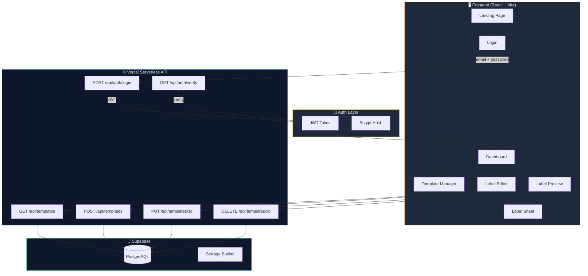
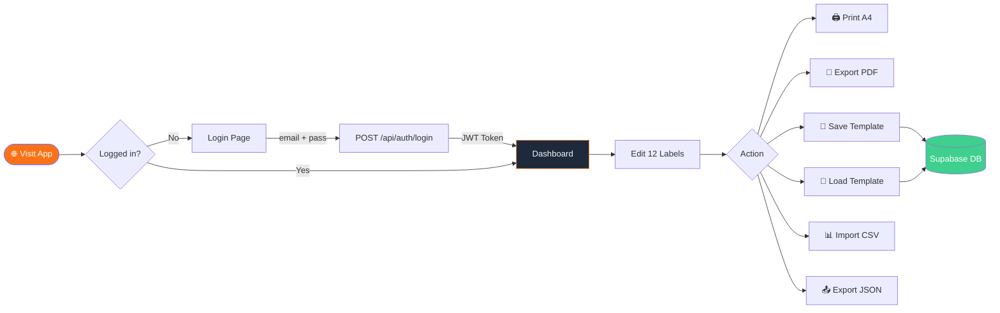
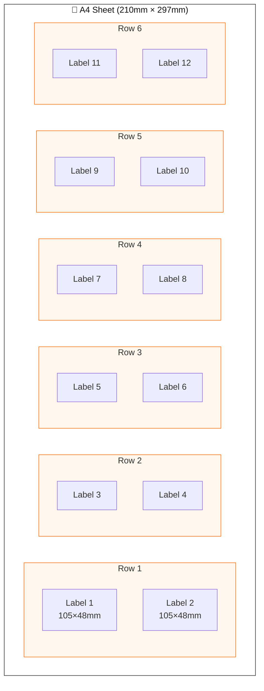
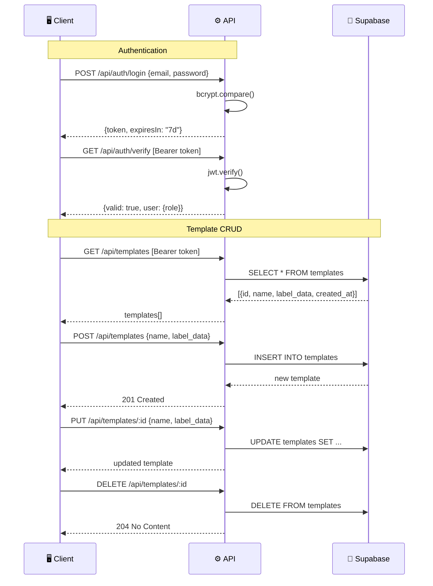
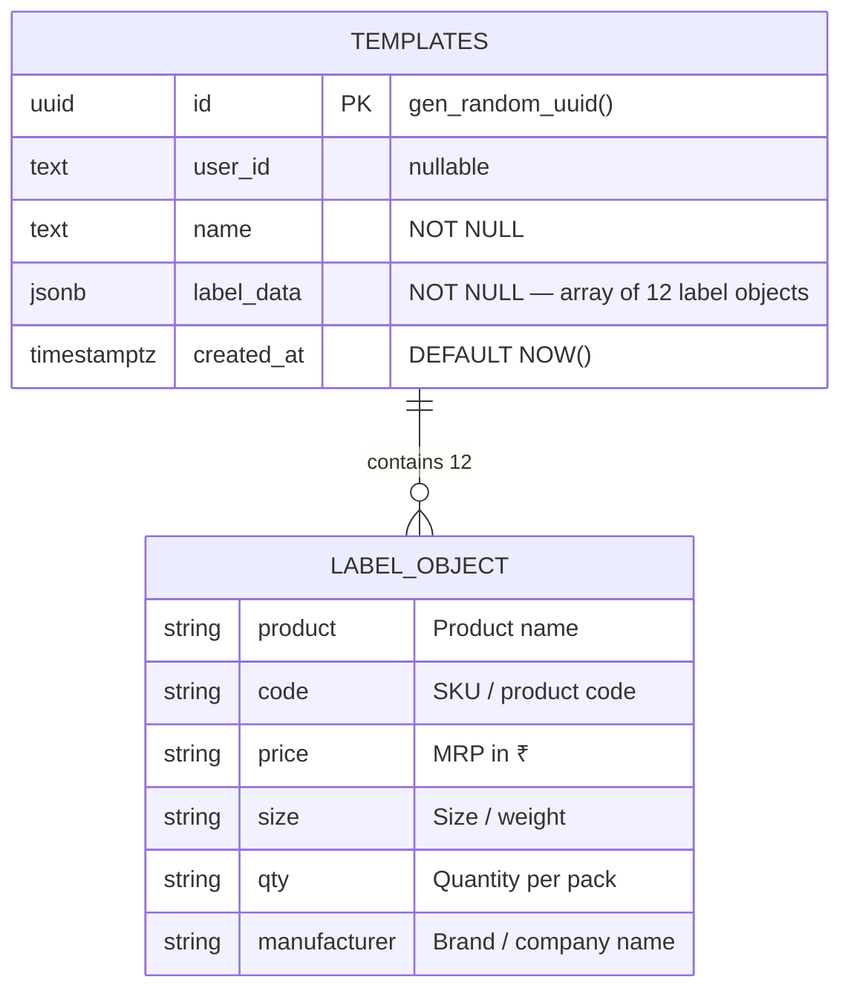

<div align="center">

# 🏷️ Shree Ganpati Agency — Label Print System

**Precision A4 label printing for product sticker sheets**

[](https://reactjs.org/)
[](https://vitejs.dev/)
[](https://tailwindcss.com/)
[](https://supabase.com/)
[](https://vercel.com/)
[]()

> Print **12 labels per A4 sheet** (105×48mm each, 2×6 grid) with live preview, cloud templates, CSV import, and PDF export. Built for Indian market workflows.

</div>

---

## 📸 Screenshots

| Landing Page | Dashboard (Editor + Preview) |
|:---:|:---:|
|  |  |

| Login Screen | Print Output (A4) |
|:---:|:---:|
|  |  |

---

## 🏗️ Architecture



---

## 🔄 User Flow



---

## 📐 Label Layout



**Each label contains:**
```
┌─────────────────────────────────────────────┐
│ [BRAND LOGO]  BRAND NAME        [QR CODE]   │
│               #Product-Code                  │
│─────────────────────────────────────────────│
│            ✦ Product Name ✦                  │
│─────────────────────────────────────────────│
│  Size: 1 kg   │  Qty: 10 pcs  │  MRP: ₹120  │
│─────────────────────────────────────────────│
│  Manufacturer: Ganpati Foods Pvt. Ltd.       │
└─────────────────────────────────────────────┘
```

---

## ✨ Features

### Core Printing
- 🏷️ **12 labels per A4 sheet** — 2×6 grid, each 105×48mm
- 📐 **Pixel-perfect A4 layout** — 210×297mm with 4.5mm margins
- 🖨️ **Native browser print** — `Ctrl+P` shortcut
- 📄 **PDF export** — Client-side via html2canvas + jsPDF (4× resolution)
- 🔢 **Multi-copy print** — 1–10 copies with page breaks
- 🎛️ **Print calibration** — Top margin offset (±5mm) + font scale (80%–130%)

### Label Features
- 📊 **6 data fields** — Product, Code, Price, Size, Qty, Manufacturer
- 🔲 **Auto QR codes** — Generated from product code/name
- 🎨 **Brand logo badges** — Color-coded 9mm corner badges (8-color palette)
- ✏️ **Smart blanks** — Empty fields render as `______` for manual fill

### Data Management
- 📥 **CSV import** — Upload or paste CSV text with preview
- 📤 **JSON export/import** — Full backup & restore
- ☁️ **Cloud templates** — Save/load/delete via Supabase
- 📋 **Copy to all 12** — Duplicate single label across sheet
- 💾 **Auto-save drafts** — Every 1.2s to localStorage
- 📜 **Print history** — Last 30 operations with restore

### UI/UX
- 🌙 **Dark theme** — Slate-900 base with saffron accent (#f97316)
- ✨ **Glassmorphism** — Frosted glass cards with blur effects
- 🎭 **Smooth animations** — Framer Motion 3D tilt + anime.js timelines
- 🔔 **Toast notifications** — react-hot-toast for all actions
- 📱 **Responsive layout** — 42% editor / 58% preview split

### Security
- 🔐 **JWT authentication** — 7-day token expiry
- 🔑 **Bcrypt password hashing** — Salt rounds: 12
- 🛡️ **Protected API routes** — All endpoints require Bearer token
- 👤 **Single admin access** — Hardcoded admin-only system

---

## 🛠️ Tech Stack

| Layer | Technology | Version |
|-------|-----------|---------|
| **UI Framework** | React | 18.2 |
| **Build Tool** | Vite | 6.0 |
| **Styling** | Tailwind CSS | 4.0 |
| **Routing** | React Router | 7.13 |
| **Animations** | Framer Motion + anime.js | 12.38 / 4.3 |
| **HTTP Client** | Axios | 1.6 |
| **QR Codes** | qrcode.react | 3.1 |
| **PDF Generation** | jsPDF + html2canvas | 2.5 / 1.4 |
| **Notifications** | react-hot-toast | 2.6 |
| **Backend** | Vercel Serverless Functions | Node.js |
| **Database** | Supabase (PostgreSQL) | — |
| **Auth** | jsonwebtoken + bcryptjs | 9.0 / 2.4 |

---

## 📂 Project Structure

```
printer-image-generator/
├── 📄 index.html              # HTML entry — meta, OG tags, PWA config
├── 📄 package.json            # Dependencies & scripts
├── 📄 vite.config.js          # React + Tailwind plugins
├── 📄 vercel.json             # Headers, caching, SPA rewrites
├── 📄 .env.example            # Environment variable template
│
├── 📁 src/                    # Frontend source
│   ├── main.jsx               # React root render
│   ├── App.jsx                # Router + AuthProvider + Routes
│   ├── index.css              # Tailwind + print CSS + animations
│   │
│   ├── 📁 components/
│   │   ├── Landing.jsx        # Public homepage (animated)
│   │   ├── Login.jsx          # Auth form (email/password)
│   │   ├── Dashboard.jsx      # Main app — editor + preview split
│   │   ├── LabelEditor.jsx    # 12 label input cards + bulk fill
│   │   ├── LabelSheet.jsx     # A4 grid renderer (QR + brand logos)
│   │   ├── LabelPreview.jsx   # Print preview + toolbar + calibration
│   │   └── TemplateManager.jsx# Save/load/delete cloud templates
│   │
│   ├── 📁 contexts/
│   │   └── AuthContext.jsx    # JWT auth state (login/logout/verify)
│   │
│   └── 📁 services/
│       └── api.js             # Axios client + auth interceptor
│
├── 📁 api/                    # Vercel Serverless Functions
│   ├── 📁 auth/
│   │   ├── login.js           # POST — authenticate, return JWT
│   │   └── verify.js          # GET — validate JWT token
│   └── 📁 templates/
│       ├── index.js           # GET (list) / POST (create)
│       └── [id].js            # GET / PUT / DELETE by ID
│
├── 📁 public/                 # Static assets
│   ├── favicon.svg            # Saffron gradient brand icon
│   ├── og-image.png           # Social preview (1200×630)
│   ├── og-image.svg           # Social preview source
│   └── icons.svg              # Icon sprite
│
├── 📁 scripts/
│   ├── generate-hash.js       # CLI: bcrypt password hash generator
│   └── generate-og.js         # CLI: OG image generator
│
└── 📁 dist/                   # Production build output
```

---

## 🔌 API Reference



| Method | Endpoint | Auth | Body | Response |
|--------|----------|------|------|----------|
| `POST` | `/api/auth/login` | ❌ | `{email, password}` | `{token, expiresIn}` |
| `GET` | `/api/auth/verify` | ✅ Bearer | — | `{valid, user}` |
| `GET` | `/api/templates` | ✅ Bearer | — | `[{id, name, label_data, created_at}]` |
| `POST` | `/api/templates` | ✅ Bearer | `{name, label_data}` | `{id, name, ...}` |
| `PUT` | `/api/templates/:id` | ✅ Bearer | `{name, label_data}` | `{id, name, ...}` |
| `DELETE` | `/api/templates/:id` | ✅ Bearer | — | `204 No Content` |

---

## 🚀 Quick Start

### Prerequisites

- **Node.js** 18+
- **npm** 9+
- **Supabase** account ([supabase.com](https://supabase.com))
- **Vercel** account ([vercel.com](https://vercel.com)) for deployment

### 1. Clone & Install

```bash
git clone https://github.com/NICK-FURY-6023/printer-image-generator.git
cd printer-image-generator
npm install
```

### 2. Setup Environment

```bash
cp .env.example .env
```

Edit `.env` with your values:

```env
# Auth
JWT_SECRET=<generate-a-strong-random-string>
ADMIN_EMAIL=shreeganpatiagency.printer@admin
ADMIN_PASSWORD_HASH=<bcrypt-hash-of-your-password>

# Supabase
SUPABASE_URL=https://your-project.supabase.co
SUPABASE_ANON_KEY=your-anon-key
```

### 3. Generate Password Hash

```bash
npm run generate-hash -- "YourSecurePassword123"
# Copy the output hash into ADMIN_PASSWORD_HASH in .env
```

### 4. Setup Supabase Database

Run this SQL in your Supabase SQL Editor:

```sql
CREATE TABLE templates (
  id UUID PRIMARY KEY DEFAULT gen_random_uuid(),
  user_id TEXT,
  name TEXT NOT NULL,
  label_data JSONB NOT NULL,
  created_at TIMESTAMPTZ DEFAULT NOW()
);

-- Enable Row Level Security (optional)
ALTER TABLE templates ENABLE ROW LEVEL SECURITY;

-- Allow all operations via anon key (for serverless functions)
CREATE POLICY "Allow all" ON templates FOR ALL USING (true);
```

### 5. Run Locally

```bash
npm run dev          # Start Vite dev server → http://localhost:5173
```

> **Note:** API routes require Vercel CLI for local testing:
> ```bash
> npx vercel dev      # Serves both frontend + API → http://localhost:3000
> ```

### 6. Deploy to Vercel

```bash
npx vercel --prod
```

Set environment variables in **Vercel Dashboard → Settings → Environment Variables**:
- `JWT_SECRET`
- `ADMIN_EMAIL`
- `ADMIN_PASSWORD_HASH`
- `SUPABASE_URL`
- `SUPABASE_ANON_KEY`

---

## 🔐 Default Login

| Field | Value |
|-------|-------|
| **Email** | `shreeganpatiagency.printer@admin` |
| **Password** | `@Shree_Ganpati@123` |

> ⚠️ **Change these in production!** Update `ADMIN_EMAIL` and regenerate `ADMIN_PASSWORD_HASH` using `npm run generate-hash`.

---

## ⌨️ Keyboard Shortcuts

| Shortcut | Action |
|----------|--------|
| `Ctrl + P` / `⌘ + P` | Print labels |
| `Ctrl + S` / `⌘ + S` | Save template |

---

## 🗄️ Database Schema



---

## 🖨️ Print Specifications

| Parameter | Value |
|-----------|-------|
| **Paper Size** | A4 (210mm × 297mm) |
| **Grid Layout** | 2 columns × 6 rows |
| **Labels per Sheet** | 12 |
| **Label Size** | 105mm × 48mm |
| **Top/Bottom Margin** | 4.5mm |
| **Label Border** | 0.3mm solid |
| **Supported Printers** | Any A4 printer (inkjet/laser) |
| **Recommended Stickers** | A4 sticker sheets (105×48mm pre-cut) |
| **Print Scale** | Always 100% (no scaling) |
| **PDF Resolution** | 4× canvas scale (3176×4492px) |

---

## 🔧 Scripts

```bash
npm run dev            # Start development server
npm run build          # Production build → /dist
npm run preview        # Preview production build locally
npm run generate-hash  # Generate bcrypt password hash
```

---

## 📋 CSV Import Format

Create a CSV file with these columns:

```csv
product,code,price,size,qty,manufacturer
Basmati Rice Premium,GR-001,120,1 kg,10 pcs,Ganpati Foods Pvt. Ltd.
Toor Dal Best Quality,TD-002,85,500 g,20 pcs,Ganpati Agency
Jaquar Diverter D-450,JD-006,3800,3/4 inch,1 pc,Jaquar & Co. Pvt. Ltd.
```

- Maximum **12 rows** (extra rows ignored)
- Missing rows auto-filled with blank labels
- Download sample CSV from the import modal

---

## 🛡️ Security Notes

- `.env` file is in `.gitignore` — **never commit credentials**
- JWT tokens expire after **7 days**
- All API routes validate Bearer token
- Passwords stored as **bcrypt hashes** (salt rounds: 12)
- CORS enabled with `Access-Control-Allow-Origin: *`
- Single admin account — no multi-user support

---

## 🤝 Contributing

1. Fork the repository
2. Create your feature branch: `git checkout -b feature/amazing-feature`
3. Commit your changes: `git commit -m 'feat: add amazing feature'`
4. Push to the branch: `git push origin feature/amazing-feature`
5. Open a Pull Request

---

## 📄 License

Private — All rights reserved by **Shree Ganpati Agency**.

---

<div align="center">

**Built with ❤️ for Shree Ganpati Agency**

*Precision labels. Every time.*

</div>
